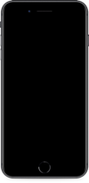

<div align="center">
  <h1>Native Pixelmatch</h1>
    
  <p>A simple solution for visual diffing in react-native</p>
 
</div>

<hr />

## Table of Contents

- [Example Output](#Example-Output)
- [The Problem](#The-Problem)
- [The Solution](#The-Solution)
- [Installation](#Installation)
- [Getting Started](#Getting-Started)
- [Similar Solutions](#Similar-Solutions)

## The Problem
You are using React Native and want to write visual regression tests alongside your Detox and Appium E2E tests.
 
 You do not want to deal with the overhead of using a Web visual regression solution for react native. 
 
 As part of your goal you want to run these visual regression tests on critical areas identified in your E2E tests to verify your code is safe before pushing code to production. You want to save your visual snapshots locally and/or compare these visual snapshots in a CI.


## The Solution
Introducing `native-pixelmatch` a lightweight solution for visual regression on the react-native platform.

- Allows for smooth integration with Detox and Appium test runners
- Able to quickly take snapshots during E2E tests and perform visual regression testing

## Example output
| expected | actual | diff |
| --- | --- | --- |
|  |  |  |

## Installation

**npm**
`npm install --save-dev native-pixelmatch`

**yarn**
`yarn add -D native-pixelmatch`

## Getting Started

Import native-pixelmatch and save the library's config prototype as a exportable variable
```
import nativePixelMatch from 'native-pixelmatch'

export const screenshotConfig = new nativePixelMatch(
	'temp',
	'shots',
	'screenshot_testing',
	'detox',
)
```

Import this exported config throughout the project
```
describe('App', () => {
	it('should create a picture', () => {
		screenshotConfig.createScreenshot('App', App-Button-Click)
		screenshotConfig.pixelDiff('App', App-Button-Click)
	})
})
```
## Similar Solutions
- [Loki Storybook Visual Diffing](https://github.com/oblador/loki) 


## Other Notes:
- This library uses the lightweight [pixelmatch](https://github.com/mapbox/pixelmatch) library.
- In the future there will be an option to opt into [GraphicsMagick](http://www.graphicsmagick.org/
